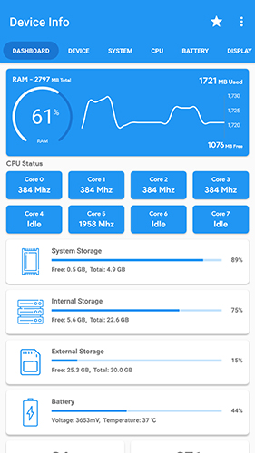
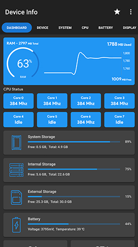

## Device-Info (com.ytheekshana.deviceinfo)
Device Info is a simple and powerful Android application which gives you the complete information about your Mobile device system software and hardware with advanced user interfaces

    
    
    

#### Prerequisites
- Android Studio 3.3
- JDK 1.8
- Android 5+ Device

### Changelog
#### Device Info 1.7.2
- Export Information
- Bug fixes in Fingerprint test

#### Device Info 1.7.0
- Camera Information
- Thermal Information
- Improved Code
- Fixed bugs
