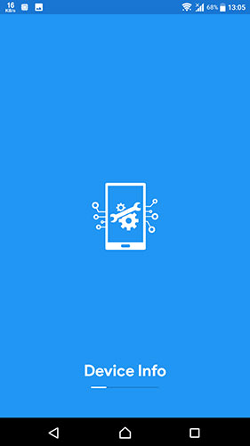
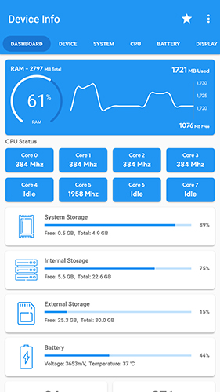

## Device-Info (com.ytheekshana.deviceinfo)
Device Info is a simple and powerful Android application which gives you the complete information about your Mobile device system software and hardware with advanced user interfaces

    
    
    

#### Prerequisites
- Android Studio 3.4
- JDK 1.8
- Android 5+ Device

### Changelog
#### Device Info 1.7.7
- Russian Support
- Bug fixes

#### Device Info 1.7.6
- Spanish Support
- Bug fixes

#### Device Info 1.7.4
- Bug fixes
